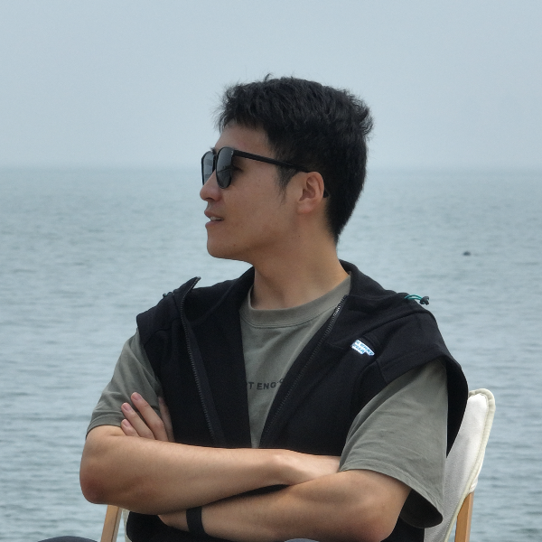

个人介绍
========

..

- **姓名**:张润
- **性别**:男
- **邮箱**:1139135655@qq.com
- **工作邮箱**:musk.zhang@dji.com
- **微信/QQ**:1139135655

..

| **哈尔滨工业大学（威海）**
| 2018年9月——2022年6月     
| 电子信息工程
| 本科

1. 综合

- 有电子设计竞赛、控制类竞赛、创新创业类竞赛经验，有嵌入式开发经验、有管理和组织经验，熟练使用C语言、MATLAB等语言，动手能力强，善于实践。
- 有较好的专业技能，有良好的沟通和合作能力
- 学习过通信原理、数字信号处理、FPGA、DSP、毫米波雷达原理等课程
- 曾担任过班长兼任团支书、学生实验室负责人

1. 一般奖项

- 哈尔滨工业大学（威海）优秀科创个人
- 优秀学生干部
- 人民三等奖学金
- “三下乡”社会实践优秀个人

3. 学生工作

- 班长兼任团支书
- 719飞行器实验室总负责人（2019年——2021年）

4. 科创竞赛奖项

- 全国大学生电子设计大赛山东赛区二等奖（无人机赛题）
- 中国国际飞行器设计挑战赛（CADC）三等奖
- 全国集成电路创新大赛华北赛区三等奖
- 哈尔滨工业大学（威海）电子设计大赛一等奖
- 哈尔滨工业大学（威海）飞行器设计大赛二等奖
- 校长杯创新大赛二等奖
- 校长杯创新大赛三等奖*3

.. image:: pic/DJI.jpg
   :align: right
   :width: 1in
..

| **深圳市大疆创新科技有限公司（DJI）**
| 2022年1月——2023年4月
| 飞行系统部
| 机器人算法工程师
