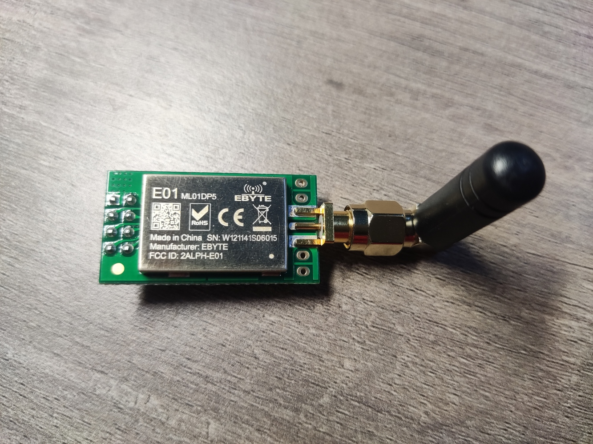
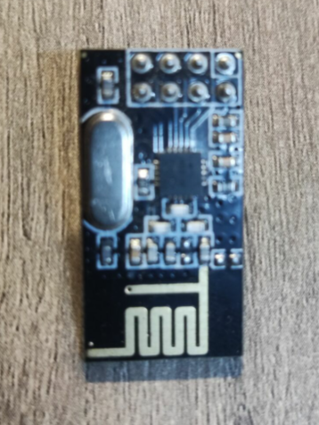
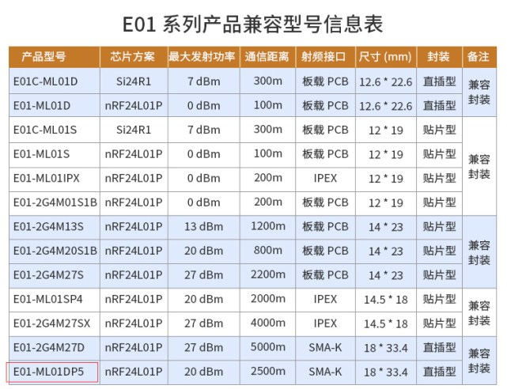
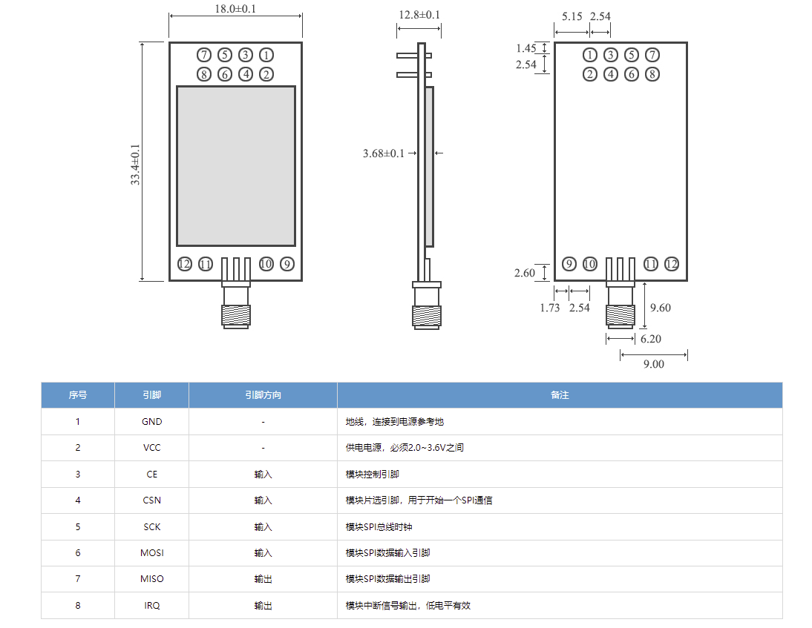

### 总览

#### 1. 模块外观

带有外置天线的增程型，这种的传输距离较远可达上千米

使用板载天线的标准型，通信距离一般几十米到百米

#### 2. 模块型号

ML01DP5

#### 3. 引脚定义

#### 4. 用户手册

[E01-ML01DP5_UserManual_CN_v1.4.pdf](https://github.com/HIT-zhangrun/blog/blob/master/doc/project/module/nrf-24l01/file/E01-ML01DP5_UserManual_CN_v1.4.pdf)

