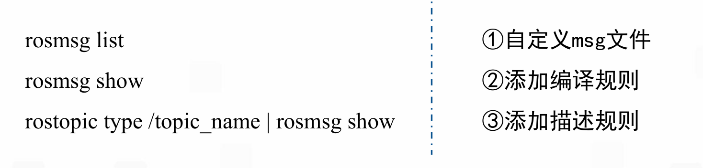
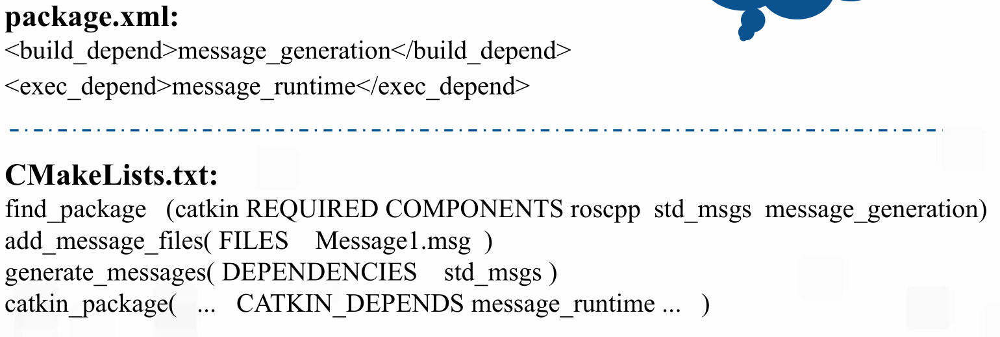

### ROS话题
#### 一、通信机制
ROS的话题是ROS的一种通信机制
特点是一对多、异步

Topic命令行指令
rostopic echo ：打印话题信息
rostopic hz ：话题频率
rostopic info ：话题信息
rostopic list ：列举话题
rostopic pub ：往话题输入信息
rostopic bw ：话题带宽
rostopic find ：从数据类型寻找话题
rostopic type ：查看话题的数据类型
#### 二、发布话题

1. 创建一个发布者
1. 创建消息数据
1. 消息赋值
1. 发布

ros::Publisher pub = nh.advertise<std_msgs::String>("topic_name", queue size);
std_msgs::String str;
str.data = "hello world";
pub.publish(str);
#### 三、订阅话题

1. 创建一个订阅者
1. 创建一个回调函数

void callback(const std_msgs::StringConstPtr& str)
{
...
}
ros::Subscriber sub = nh.subscribe("my_topic", queue size, callback);
##### 四、自定义消息类型

