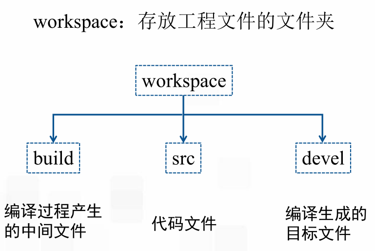
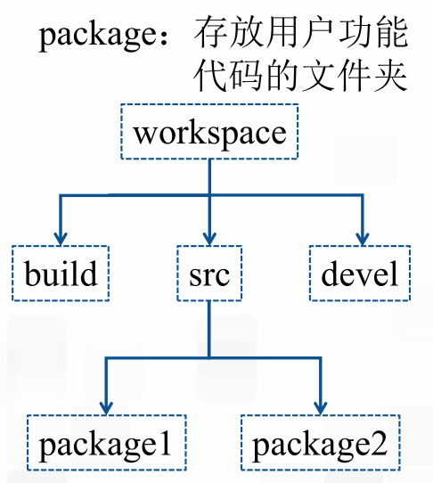

### ROS的工作空间和功能包
#### 一、工作空间

1. 创建工作空间

mkdir -p ~/catkin_ws/src
cd ~/catkin_ws/src
catkin_init_workspace初始化工作空间

2. 编译工作空间

cd ../  返回主目录
catkin_make  编译

3. 添加环境变量

source devel/setup.bash
echo $ROS_PACKAGE_PATH查看ROS的环境变量

#### 二、功能包
功能包就是每个ros的功能个体

一个功能包中的内容
include: .h文件
src: .cpp文件
launch： launch文件
urdf： .urdf文件
config： 参数文件，yaml，srv，msg，action
scripts：可执行脚本文件（python）
CMakelist： 编译规则
package.xml：定义package的属性

#### 三、创建功能包
catkin_create_pkg <package_name> [depend1] [depend2] [depend3]
例如：catkin_create_pkg  new_package std_msgs rospy roscpp
