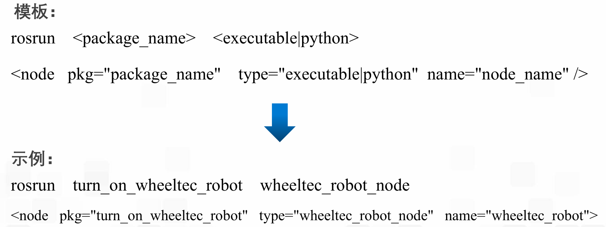

### launch文件与参数服务器
#### 一、launch文件
可以实现多节点启动和参数配置的xml文件

launch标签总览

根标签：launch文件的标签内容都需要包含在根标签下
嵌套：包含其他的launch文件，包含其他的xml文件
节点：

参数：区别
<param>，在参数服务器中添加一个参数
<rosparam>，从“.yaml”文件中一次性导入大量参数
<arg>，在launch中声明一个参数
参数服务器：

节点分组：

重命名：

